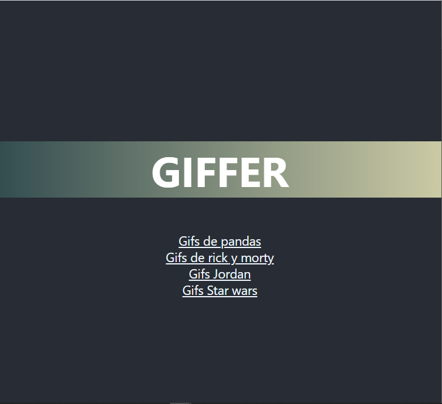

# GIFFER

_This project is a little application, to practice reactjs were made a fetch to GIPHY's API and added routes with wouter._

## Built with 🛠️

* [React](https://es.reactjs.org/) - A JavaScript library for building user interfaces.
* [Wouter](https://github.com/molefrog/wouter) - A tiny routing solution for modern React.
* [GIPHY](https://developers.giphy.com/) - GIPHY SDK helps you integrate the world's largest GIF library, customize a suite of powerful features, and boost engagement with just a few lines of code.

This project was bootstrapped with [Create React App](https://github.com/facebook/create-react-app).

## GIFFER

## Available Scripts

In the project directory, you can run:

### `yarn start`

Runs the app in the development mode. 
Open [http://localhost:3000](http://localhost:3000) to view it in the browser.

The page will reload if you make edits. 
You will also see any lint errors in the console.

### `yarn test`

Launches the test runner in the interactive watch mode. 
See the section about [running tests](https://facebook.github.io/create-react-app/docs/running-tests) for more information.

### `yarn build`

Builds the app for production to the `build` folder. 
It correctly bundles React in production mode and optimizes the build for the best performance.

The build is minified and the filenames include the hashes. 
Your app is ready to be deployed!

See the section about [deployment](https://facebook.github.io/create-react-app/docs/deployment) for more information.

### Authors ✒️

* **César Enrique** - *Initial work* - [cesarevc](https://github.com/cesarevc)

**Free Software, Hell Yeah!**

---
⌨️ with ❤️ by [cesarevc](https://github.com/cesarevc) 